# AutoOps-AI

[](https://www.python.org/)
[](https://fastapi.tiangolo.com/)
[](LICENSE)
[](https://github.com/mdsaad360/AutoOps-AI/actions/workflows/build.yaml)


AutoOps-AI is a portfolio project showcasing the design and implementation of a production-style, cloud-native AI service using modern DevOps and GitOps practices.

- 🚀 **FastAPI** microservice with `/health` and `/predict`
- 🐳 Containerization with **Docker** and Orchestration with **Kubernetes**
- ⚙️ CI/CD with **GitHub Actions** + GitOps via **ArgoCD**
- ☁️ Cloud-ready (AWS EKS)


## Table of Contents
- [System Overview](#system-overview)
- [Tech Stack](#tech-stack)
- [System Architecture](#system-architecture-high-level)
- [Phase 1 - Application Development](#phase-1---local-fastapi-app)
- [Phase 2 - Containerization with Docker](#phase-2---dockerized-fastapi-app)
- [Phase 3 - CI with GitHub Actions](#phase-3---ci-with-github-actions)
- [Phase 4 - Image Registry Integration (Docker Hub)](#phase-4---docker-hub-integration)
- [Phase 5 - AI Inference & Testing](#phase-5a---dummy-predict-logic--unit-testing)
- [Phase 6 - Kubernetes Deployment ](#phase-6a---local-kubernetes-simulation-using-minikube)
- [Phase 7 - GitOps Continuous Deployment with ArgoCD](#phase-7a---gitops-repository-creation)
- [Failure Scenarios & Recovery](#failure-scenarios--recovery)
- [Security Considerations](#security-considerations)
- [Design Decisions & Trade-offs](#design-decisions--trade-offs)
- [Future Enhancements](#future-enhancements)


## System Overview

AutoOps-AI is a production-style AI inference platform that demonstrates the complete lifecycle of a modern cloud-native application.

The project progresses from local development to a fully automated deployment pipeline, culminating in a secure, HTTPS-enabled production setup on AWS-managed Kubernetes.

**High-level flow:**
Developer
→ GitHub (App Repo)
→ GitHub Actions (CI)
→ Docker Hub (Image Registry)
→ GitOps Repository (Manifests)
→ ArgoCD (CD)
→ AWS EKS (Kubernetes)
→ Users via HTTPS (Ingress + Route53)

**Key goals:**
- Demonstrate real-world CI/CD and GitOps workflows
- Apply DevOps best practices across the full application lifecycle
- Showcase secure, production-ready Kubernetes deployment


## Tech Stack

**Application:**
- Python 3.11
- FastAPI
- Hugging Face Transformers (DistilBERT)

**Container & CI:**
- Docker
- GitHub Actions
- Docker Hub

**Kubernetes & GitOps:**
- Kubernetes (Minikube, AWS EKS)
- ArgoCD
- NGINX Ingress Controller
- cert-manager

**Cloud & Networking:**
- AWS EC2
- AWS EKS
- AWS ALB
- AWS Route53
- TLS (Let's Encrypt)


## System Architecture (High Level)

The system follows a decoupled CI/CD and GitOps architecture where artifact creation and deployment are intentionally separated.

Continuous Integration is responsible for building immutable artifacts, while Continuous Deployment is handled declaratively by a GitOps controller.

### Architectural Flow

- Application code changes are pushed to the source repository.
- The CI pipeline validates code quality, runs tests, and builds container images.
- Versioned container images are published to an image registry.
- Deployment state is defined in a separate GitOps repository.
- ArgoCD continuously monitors the GitOps repository and reconciles the Kubernetes cluster to match the declared state.
- End users access the application through an HTTPS-secured ingress layer.

### Architectural Principles

- Immutable artifacts
- Git as the single source of truth
- Automated reconciliation and drift detection
- Zero-downtime rolling updates
- Secure ingress with TLS termination


## Phase 1 - Local FastAPI App

✅ Features implemented:
- `/health` endpoint returning service status
- `/predict` endpoint (placeholder for AI logic)
- Logging enabled
- Swagger UI available at: [http://127.0.0.1:8000/docs](http://127.0.0.1:8000/docs)

## Setup Instructions

### 1. Clone repo & create environment
```powershell
git clone https://github.com/mdsaad360/autoops-ai.git
cd autoops-ai
python -m venv venv
.\venv\Scripts\activate
```

### 2. Install dependencies
```powershell
pip install -r requirements.txt
```

### 3. Run the app
```powershell
uvicorn app.main:app --reload
```

### 4. Test endpoints
Health check: http://127.0.0.1:8000/health

Swagger UI: http://127.0.0.1:8000/docs


## Phase 2 - Dockerized FastAPI App

✅ Features implemented:
- Added `Dockerfile` and `.dockerignore`
- App runs inside a Docker container
- Port mapping allows access from host at `127.0.0.1:8000`
- Ready for future use with Kubernetes and AWS

### Run with Docker

1. **Build the image**
```powershell
docker build -t autoops-ai:1.0 .
```

2. **Run the container**
```powershell
docker run -d -p 8000:8000 autoops-ai:1.0
```

3. **Test endpoints**
```
Health check → http://127.0.0.1:8000/health
Swagger UI → http://127.0.0.1:8000/docs
```

4. **Optional: Run with Docker Compose**
```powershell
docker compose up --build
```

## Phase 3 - CI with GitHub Actions

✅ Features implemented:
- Added workflow file: `.github/workflows/build.yml`
- Configured GitHub Actions to run on:
  - Pull requests → lint + unit tests
  - Push to `main` → lint + unit tests + Docker image build
- Added real unit tests with `pytest`:
  - `/health` endpoint returns `{"status": "ok"}`
  - `/predict` endpoint returns `"Model not implemented yet"`
- Configured linting with `flake8` for code quality checks
- Docker images tagged with both:
  - `autoops-ai:latest` (human-friendly)
  - `autoops-ai:<commit-sha>` (traceable, reproducible)
- Added `pytest.ini` to ensure imports resolve cleanly
- CI/CD status badge added to README

### Test the CI Workflow

1. **Trigger**  
   - Create a Pull request → Runs tests & lint only  
   - Push to main → Runs tests, lint, and builds Docker image  

2. **Check pipeline status**  
   - Go to your repo’s **Actions** tab  
   - Select the workflow **“Test & Build Pipeline”**  
   - View logs for lint, test, and Docker build steps 


## Phase 4 - Docker Hub Integration

✅ Features implemented:
- Updated CI pipeline (`.github/workflows/build.yaml`) to build and push Docker images to **Docker Hub**.  
- Added GitHub repository **Secrets** and **Variables**:
  - `DOCKERHUB_USERNAME` (variable) → Docker Hub account name.  
  - `DOCKERHUB_TOKEN` (secret) → Docker Hub personal access token.  
- Used **official GitHub Actions (`docker/login-action` + `docker/build-push-action`)** for a clean, production-grade setup.  
- Images are pushed with **two tags** for traceability:
  - `latest` → always the most recent build.  
  - `<commit-sha>` → uniquely tied to the exact commit (traceable + reproducible).

### How to Verify
1. Go to **Docker Hub** → [https://hub.docker.com/repositories/mdsaad360](https://hub.docker.com/repositories/mdsaad360)  
2. Confirm `autoops-ai` repo exists and contains both `latest` and commit-specific tags.  
3. Check GitHub Actions logs under the **“Build and Push Docker image”** step.

### Run the Image
```bash
# Pull the latest image from Docker Hub
docker pull mdsaad360/autoops-ai:latest

# Run the container locally
docker run -d -p 8000:8000 mdsaad360/autoops-ai:latest

# Test the health endpoint
curl http://localhost:8000/health
```

## Phase 5a - Dummy Predict Logic & Unit Testing

✅ Features implemented:
- Added a dummy sentiment analysis predict logic.
- Added test case for predict endpoint for:
  - `/predict` endpoint with mock sentiment analysis (positive/negative inputs).

## How to Run Locally

```bash
# Pull docker image
docker pull mdsaad360/autoops-ai:latest

# Start the container
docker run -d -p 8000:8000 mdsaad360/autoops-ai:latest

# Test predict endpoint
curl -X POST "http://127.0.0.1:8000/predict" -H "Content-Type: application/json" -d '{"text":"Even"}'

curl -X POST "http://127.0.0.1:8000/predict" -H "Content-Type: application/json" -d '{"text":"Odd"}'
```

## Phase 5b - Add AI Inference (Sentiment Analysis)

✅ Features implemented:
- Integrated  Hugging Face Transformers `pipeline("sentiment-analysis")`.
- Installed additional dependencies: `transformers` and `torch`(CPU-only).
- Updated FastAPI `/predict` endpoint to:
  - Accept text input.
  - Run it through `distilbert-base-uncased-finetuned-sst-2-english`.
  - Return sentiment label (POSITIVE/NEGATIVE) and confidence score.
- Extended test cases to verify model predictions (positive/negative).
- Improved app logging for better observability during tests.

## How to Run Locally

```bash
# Pull docker image
docker pull mdsaad360/autoops-ai:latest

# Start the container
docker run -d -p 8000:8000 mdsaad360/autoops-ai:latest

# Test predict endpoint
curl -X POST "http://127.0.0.1:8000/predict" -H "Content-Type: application/json" -d '{"text":"I love coding!"}'

curl -X POST "http://127.0.0.1:8000/predict" -H "Content-Type: application/json" -d '{"text":"I hate dragon fruit"}'
```
## Expected Output
```json
{
  "input": "I love coding",
  "label": "POSITIVE",
  "score": 0.9996923208236694
}

{
  "input": "I hate dragon fruit",
  "label": "NEGATIVE",
  "score": 0.9971433281898499
}
```

## Phase 5c - Add pip Dependency and Docker Build Caching in CI/CD

✅ Features implemented:
- Optimized our CI/CD pipeline by caching Python dependencies. This prevents reinstalling the same packages on every run, reducing pipeline execution time.
- Enabled **`Docker build caching`**. This reduces build times by reusing unchanged layers instead of rebuilding everything from scratch.


## Phase 5d -  Add Dockerfile dev setup

✅ Features implemented:
- Added a separate **`Dockerfile.dev`** for local development:
  - Uses `uvicorn --reload` for auto-restart on code changes
  - Mounts source code into the container (`volumes`) so edits reflect immediately

- Added **`docker-compose.override.yml`**:
  - Overrides the default compose configuration only in local dev
  - Automatically uses `Dockerfile.dev` instead of the production Dockerfile
  - Runs the app in hot-reload mode

-  Run in DEV mode:
  ```bash
  docker compose -f docker-compose.override.yaml up --build
  ```

## Phase 6a - Local Kubernetes Simulation using Minikube

✅ Features implemented:
- Installed and configured Minikube for local Kubernetes.
- Initialized a local single-node Kubernetes cluster.
- Learned and validated Kubernetes core concepts:
  - Pods
  - Deployments
  - Services (NodePort)

- Deployed autoops-ai using Kubernetes manifests.

- Exposed the application locally via NodePort.

- Verified application behavior inside a Kubernetes runtime.


## Phase 6b - Host autoops-ai on AWS EC2 (HTTP)

✅ Features implemented:
- Launched an EC2 Ubuntu instance (default VPC) with a public IP.

- Used SSH key-based authentication.

- Opened Security Group inbound ports: SSH (22) restricted to my IP, HTTP/testing port (8000) open as needed.

- Installed and configured Docker on EC2.

- Pulled autoops-ai image from Docker Hub.

- Ran the container manually on EC2.

- Exposed the application via EC2 public IP over HTTP.


## Setup Instructions

### 1. Launch EC2 (Fast-track using default VPC)
- AMI: Ubuntu 22.04

- Instance type: t3.micro

- Key pair: create / download .pem

- Security Group inbound rules:

  - SSH (22) — Source: My IP

  - Custom TCP (8000) — Source: 0.0.0.0/0 (for testing)

### 2. SSH into EC2
```bash
ssh -i ./your_key_name.pem ubuntu@<ec2_public_ip>
```

### 3. Install Docker & Compose
```bash
# 1. Update the package index
sudo apt-get update

# 2. Install necessary packages to allow apt to use a repository over HTTPS
sudo apt-get install apt-transport-https ca-certificates curl software-properties-common -y

# 3. Add Docker's official GPG key
curl -fsSL https://download.docker.com/linux/ubuntu/gpg | sudo gpg --dearmor -o /etc/apt/keyrings/docker.gpg

# 4. Set up the stable repository
echo "deb [arch=$(dpkg --print-architecture) signed-by=/etc/apt/keyrings/docker.gpg] https://download.docker.com/linux/ubuntu $(lsb_release -cs) stable" | sudo tee /etc/apt/sources.list.d/docker.list > /dev/null

# 5. Update the package index again with the new repository data
sudo apt-get update

# 6. Install Docker Engine, CLI, and Containerd
sudo apt-get install docker-ce docker-ce-cli containerd.io docker-buildx-plugin docker-compose-plugin -y

# 7. Verify the installation
sudo docker run hello-world
```

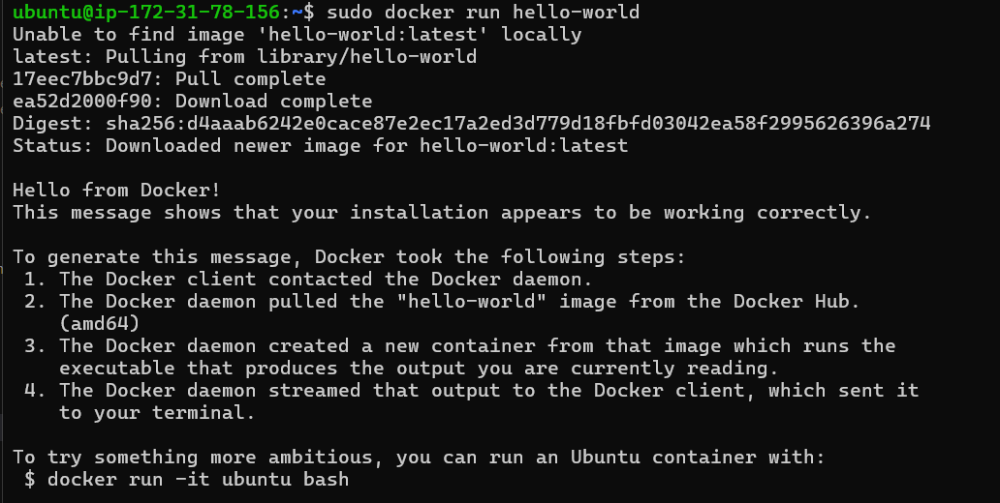

```bash
# 8. Manage Docker as a non-root user (For this change to take effect, you must log out of your SSH session and log back in. )
sudo usermod -aG docker ${USER}
```

### 4. Deploy app
```bash
docker pull mdsaad360/autoops-ai:latest

docker run -d -p 8000:8000 mdsaad360/autoops-ai:latest

docker ps
```

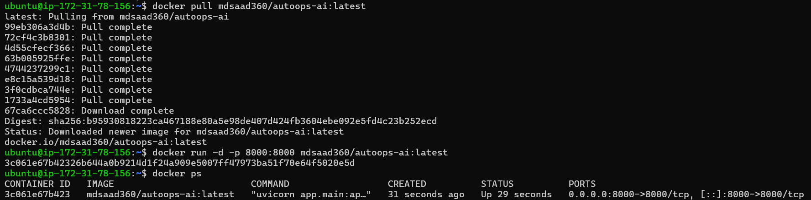

### 5. Verify the app
```bash
#Run below outside instance to verify the app is running
curl http://<EC2_PUBLIC_IP>:8000/health
```

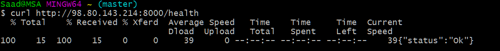


## Phase 6c - Host autoops-ai on AWS EKS (HTTP via ALB)

✅ Features implemented:
- Installed and configured AWS CLI.
- Created an EKS cluster via a config file( [cluster.yaml](https://github.com/mdsaad360/autoops-ai-gitops/blob/main/cluster.yaml) ).
- Generated and updated kubeconfig using AWS CLI.
- Deployed autoops-ai using Kubernetes manifests( [deployment.yaml](https://github.com/mdsaad360/autoops-ai-gitops/blob/main/base/deployment.yaml) ).
- Created Kubernetes LoadBalancer Service( [service-lb.yaml](https://github.com/mdsaad360/autoops-ai-gitops/blob/main/service-lb.yaml) ).
- Exposed application publicly via ALB DNS over HTTP.

## Setup Instructions

###  1. Install and configure AWS CLI
```bash
pip install awscli --upgrade --user

aws configure   # set access key, secret, region, default output
```

### 2. Create an EKS Cluster
```bash
eksctl create cluster -f cluster.yaml
```
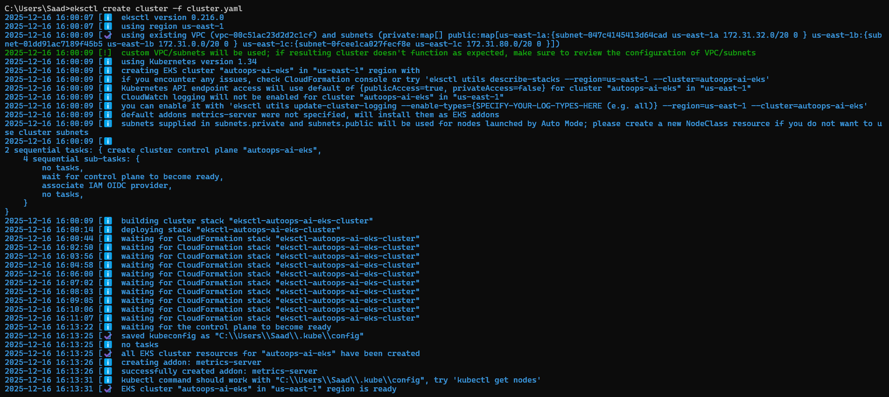

### 3. Create and verify app deployment and load balancer service
```bash
aws eks update-kubeconfig --region us-east-1 --name autoops-ai-eks
```

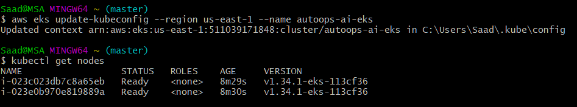

```bash
kubectl apply -f deployment.yaml

kubectl apply -f serivce-lb.yaml
```

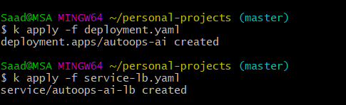

```bash
kubect get deployments

kubectl get pods -o wide

kubectl get svc autoops-ai-lb
```

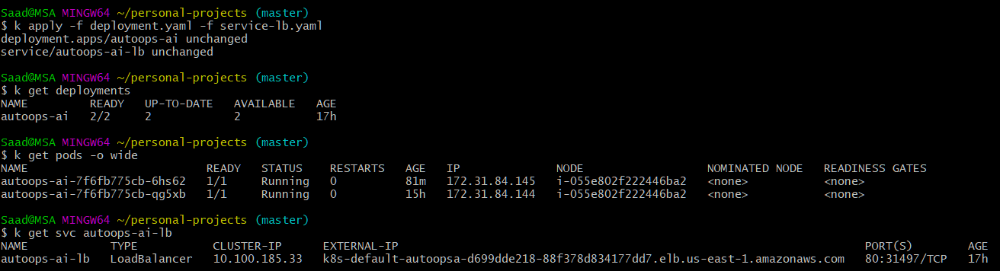

### 4. Test the app
```bash
curl http://<LB_DNS>/health

curl http://<LB_DNS>/predict -H "Content-Type: application/json" -d '{"text":"I love DragonFruit!"}'
``` 

Bash

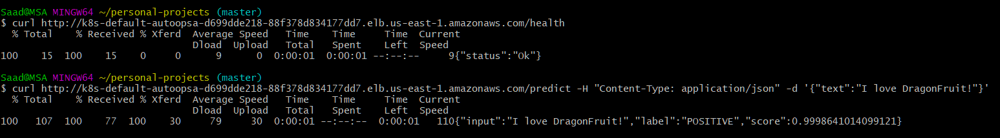

Postman

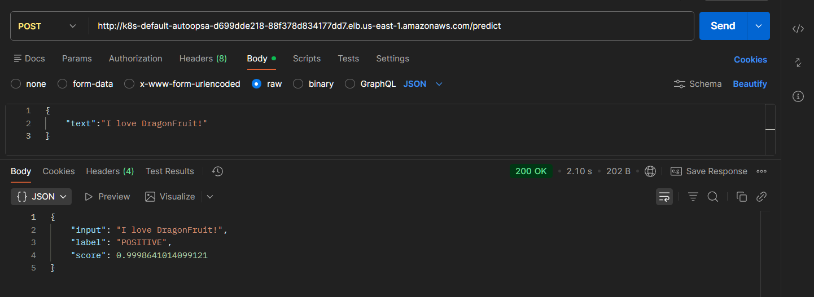

Web - health endpoint

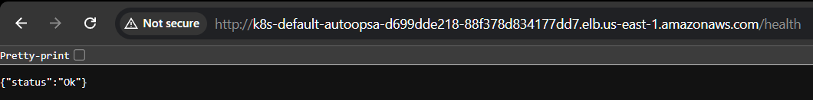

Web - Documentation 

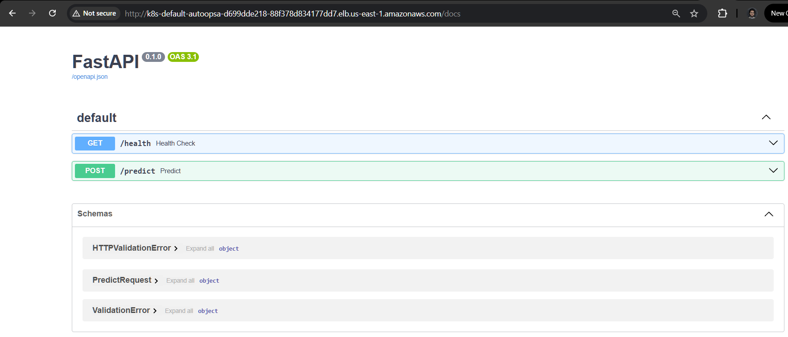


## Phase 6d - Domain, TLS & HTTPS (Ingress + Route53)

✅ Features implemented:

- Purchased custom domain: autoops-ai.cloud.

- Configured AWS Route53 Hosted Zone( DNS fundamentals - A, CNAME, Alias records).

- Installed Ingress NGINX Controller on EKS.

- Installed cert-manager for certificate automation.

- Configured Let’s Encrypt ClusterIssuer( [cluster-issuer.yaml](https://github.com/mdsaad360/autoops-ai-gitops/blob/main/base/cluster-issuer.yaml) ).

- Created Kubernetes Ingress resources( [autoops-ingress.yaml](https://github.com/mdsaad360/autoops-ai-gitops/blob/main/base/autoops-ingress.yaml) ).

- Integrated HTTPS using TLS secrets.

- Routed domain traffic to Ingress Load Balancer via Route53.

- Exposed autoops-ai securely over HTTPS.

### 
Domain - GoDaddy

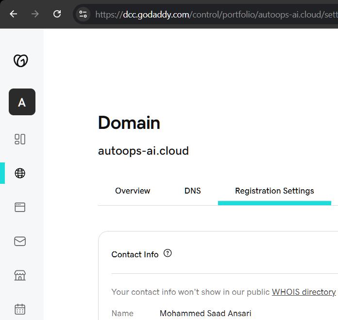

Route53 HZ

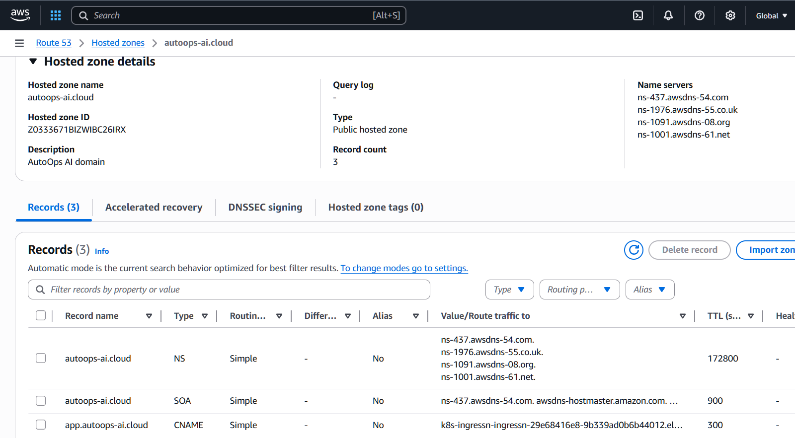

## Test results

Web - health endpoint

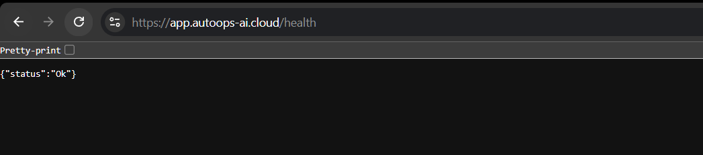

Web - Documentation

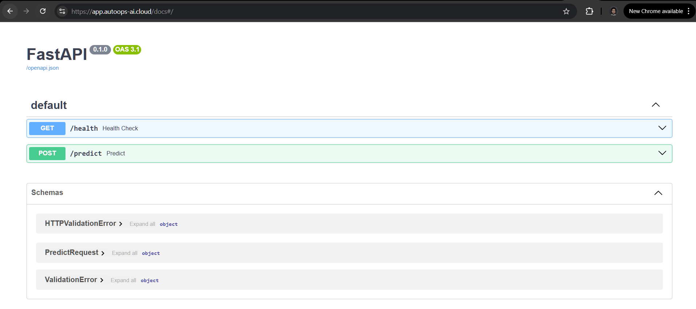

Postman - predict endpoint

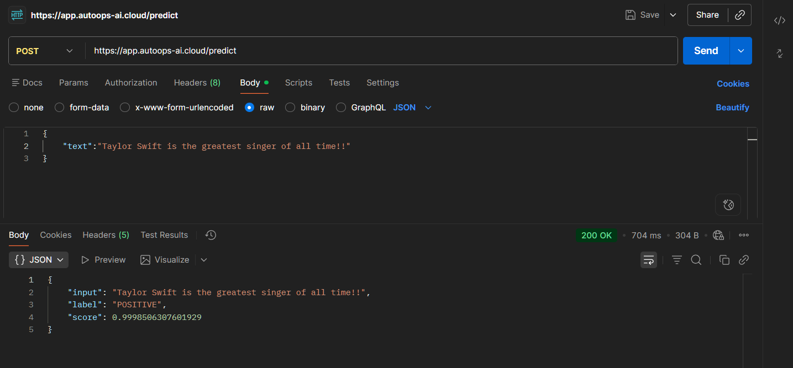


## Phase 7a - GitOps Repository Creation

✅ Features implemented:

- Created a dedicated GitOps repository( [autoops-ai GitOps repo](https://github.com/mdsaad360/autoops-ai-gitops) ).

- Uploaded Kubernetes manifests to the gitops repo( [K8s manifests](https://github.com/mdsaad360/autoops-ai-gitops/tree/main/base) ).

- Established declarative infrastructure management.

- Enabled version-controlled deployments.


## Phase 7b - Install ArgoCD on EKS & link ArgoCD to the GitOps Repository

✅ Features implemented:

- Installed ArgoCD in EKS cluster.

- Exposed ArgoCD UI securely and retrieved and updated admin credentials.

- Created ArgoCD Application resource and linked ArgoCD to the GitOps repository( [argocd.yaml](https://github.com/mdsaad360/autoops-ai-gitops/blob/main/argocd.yaml) )

- Enabled automatic synchronization.

- Ensured cluster state always matches Git state.

ArgoCD UI

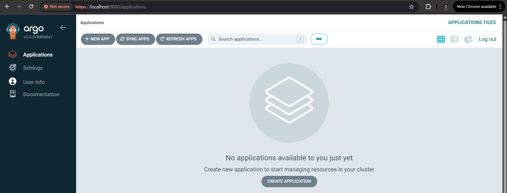 


## Phase 7c - End to End CI/CD Validation

✅ Features implemented:

- GitHub Actions builds and pushes Docker images( [Workflow : build.yaml](https://github.com/mdsaad360/autoops-ai/blob/main/.github/workflows/build.yaml) | [Docker Hub : autoops-ai](https://github.com/mdsaad360/autoops-ai-gitops/blob/main/base/deployment.yaml) ).

- Image tags automatically updated in GitOps repo( [Line no. 17 at deployment.yaml](https://github.com/mdsaad360/autoops-ai-gitops/blob/main/base/deployment.yaml) ) .

- ArgoCD detects Git changes and deploys new versions.

- Rolling updates replace old pods automatically.

- Verified zero-downtime deployments.

Snippet responsible for updating the image tag in the gitops repo

 

Automatic image update in the gitops repo

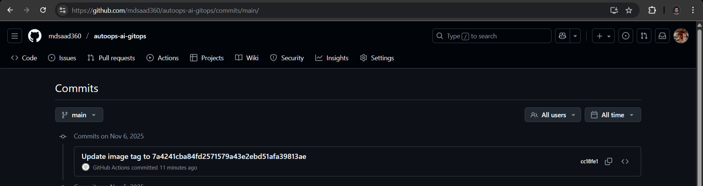

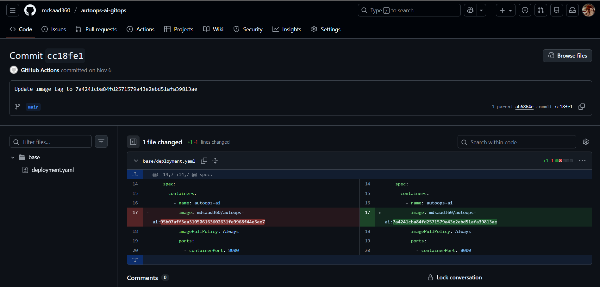

## CICD Result

Old image in DHCR

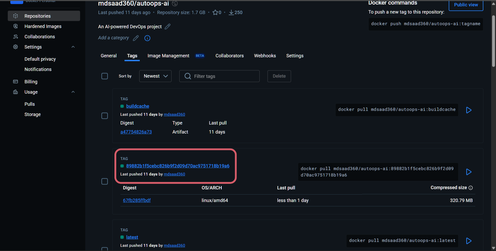

Old image in k8s/ArgoCD UI

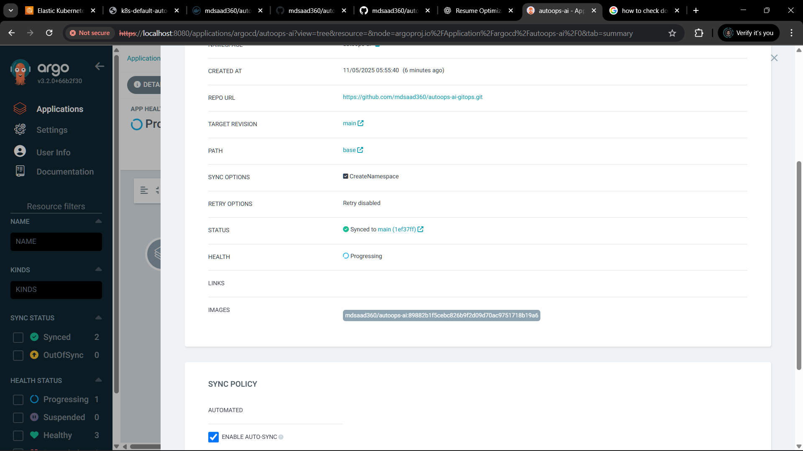

New image built and pushed to DHCR

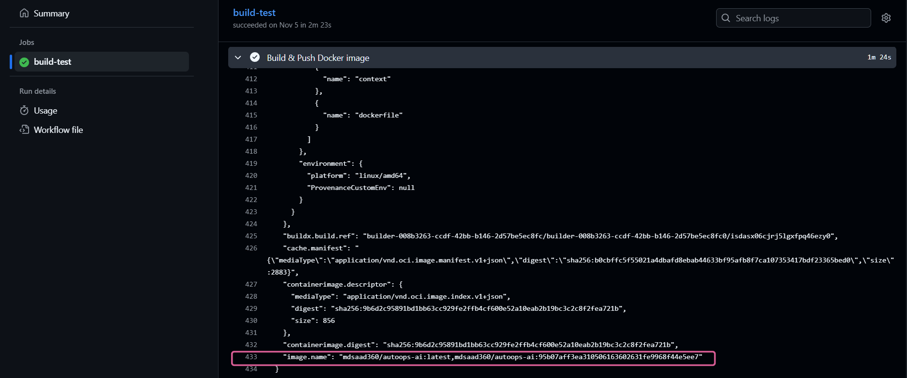

New image in DHCR

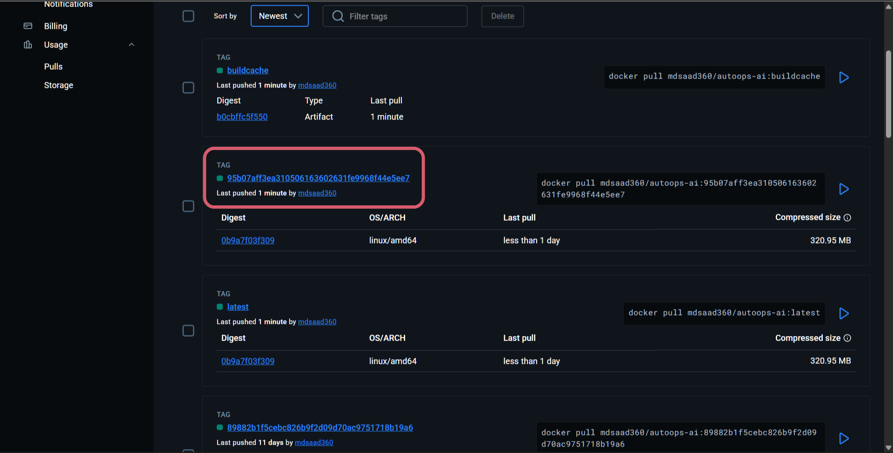

New image tag updated in the gitops repo

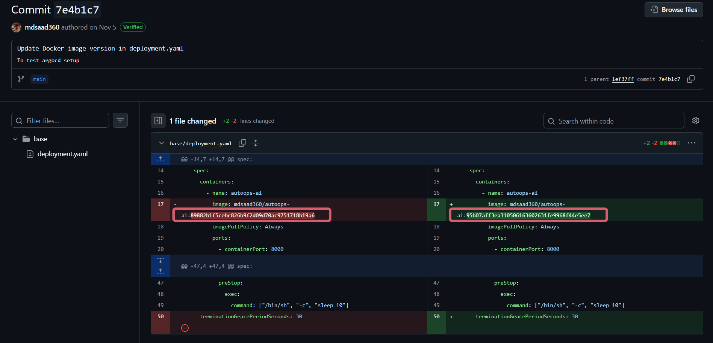

New image update rolling in ArgoCD UI

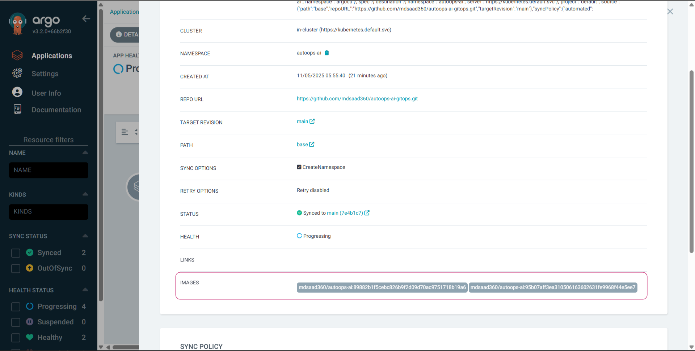

New image updated in k8s/ArgoCD UI

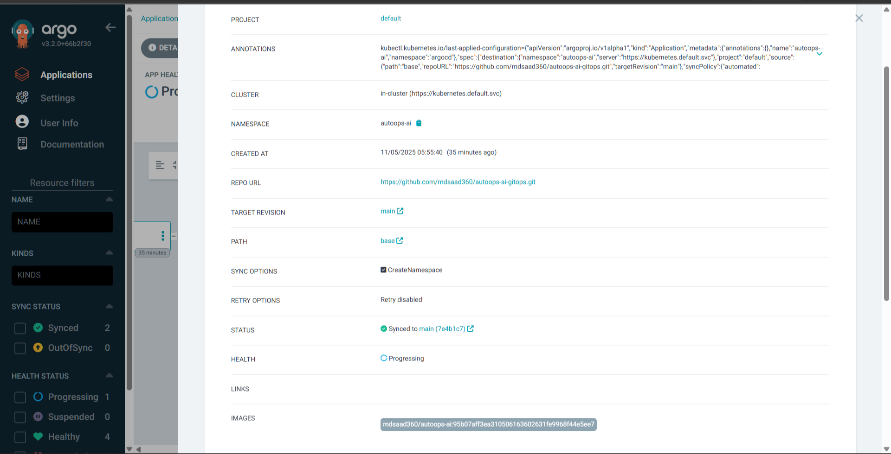

Healthy ArgoCD Setup!


## Failure Scenarios & Recovery

### CI Pipeline Failure
**Scenario:** Linting or unit tests fail  
**Recovery:**
The pipeline blocks image creation and prevents any changes from reaching the GitOps repository, ensuring faulty code never reaches production.

### Docker Image Build or Push Failure
**Scenario:** Image build or Docker Hub push fails  
**Recovery:**
No image tag update occurs in the GitOps repository, so ArgoCD does not trigger any deployment.

### Faulty Application Deployment
**Scenario:** New image causes runtime errors  
**Recovery:**
- Kubernetes rolling updates prevent full outage
- Previous stable pods continue serving traffic
- Rollback achieved by reverting image tag in GitOps repository

### Cluster Drift
**Scenario:** Manual changes made directly to the cluster  
**Recovery:**
ArgoCD detects drift and automatically reconciles the cluster back to the desired Git state.


## Security Considerations

### Secrets Management
- Sensitive credentials (Docker Hub token, GitOps Repo token) are stored securely using GitHub Secrets.
- No secrets are hard-coded in application code or Kubernetes manifests.

### CI/CD Security Boundaries
- CI pipeline does not have direct access to the Kubernetes cluster.
- Deployment authority is delegated to ArgoCD, reducing blast radius.

### Network Security
- Application exposed only through Kubernetes Ingress and ALB.
- TLS enforced using HTTPS with certificates issued by Let’s Encrypt.
- EC2 SSH access restricted to a known IP during setup.

### Kubernetes Security
- Application runs as a stateless service to simplify scaling and recovery.
- Namespace isolation is used to separate system components (ArgoCD, app workloads).

### Supply Chain Security (Baseline)
- Immutable Docker images with commit-SHA tags
- Reproducible builds
- Version-controlled deployment state


## Design Decisions & Trade-offs

### GitOps vs Direct CI Deployments
Instead of allowing GitHub Actions to deploy directly to the Kubernetes cluster, this project uses ArgoCD and a GitOps repository. This enforces a clear separation of concerns, improves auditability, and aligns with production Kubernetes best practices.

### Separate App and GitOps Repositories
Application code and Kubernetes manifests are stored in separate repositories to avoid coupling deployment state with application logic. This mirrors enterprise setups where platform and application responsibilities are decoupled.

### Commit-SHA Image Tagging
Using commit-SHA tags ensures every deployment is traceable to a specific code version. This simplifies debugging, rollbacks, and compliance audits.

### Progressive Kubernetes Adoption
Kubernetes is introduced incrementally (Minikube → EC2 → EKS) to validate behavior at each layer before increasing complexity. This reduces risk and mirrors real infrastructure migration strategies.


## Future  Enhancements:

- [ ] **AI Model Upgrade**: Transition to more advanced models
- [ ] **Helm Modularization**: Package Kubernetes manifests into **Helm Charts** to simplify deployment and versioning across environments.
- [ ] **Infrastructure as Code (IaC)**: Fully automate the AWS setup using **Terraform** to ensure a reproducible and scalable environment.
- [ ] **Observability Stack**: Implement a monitoring and alerting system using **Prometheus and Grafana** for real-time cluster health insights.
- [ ] **CI/CD Integration**: Extend GitOps workflows to include security scanning with **GitHub Actions**.